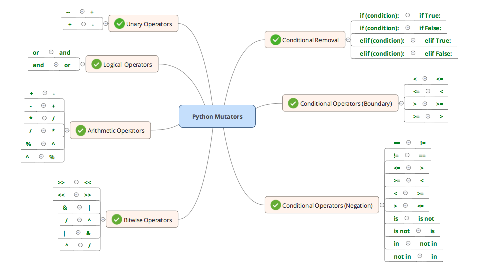

# mutate

## Summary
There are a lot of tools out there for python3 mutation testing, but there was nothing that was targeted python 2.7.x (or at least nothing that wasn't years old and had no support), so this is an attempt to fill that gap.

This tool is primarily designed for usage at the unit test level. I took inspiration from tools such as [pitest](http://pitest.org/) in that I didn't want to take a 'brute force' approach to mutation where you would substitute any (say) arithmetic operator with every possible alternative, but rather use more subtle and considered mutations to make the resulting 'mutant space' less overwhelming and easier to negotiate, so the users could see the proverbial wood for the trees.

Currently, the tool focuses on mutation in the following operator classifications:

  - Logical Operators (negation)
  - Arithmetic Operators (negation)
  - Bitwise Operators (negation)
  - Unary Operators (negation)
  - Conditional Operators (boundary, negation & removal)
  
Details of the specific mutations are shown in the mindmap below.

## Installation
`git clone http://git.prod.skyscanner.local/DelDewar/mutate.git mutate`

`cd mutate`

[set up your virtual environment with python 2.7.x]

`pip install -r requirements.txt`

## Usage:

To try it out use the sample files included by running:

`mutate -f file_under_test.py -t test_file_under_test.py`

The files passed can just be file names, relative or absolute paths but must exist and must be python files. 

## Restrictions/Dependencies:

* The tool does currently assumes that pytest is the test runner of choice (sorry, nose fans) but it's nothing too deep (just interpretation of the test results which can be easily tweaked) and multi test runner support could be introduced at some stage down the line.

## Limitations/Bugs

* In the instance of 'elif' conditional replacement mutations, the log file will show 'elif' as 'if' - this is just due to the structure of the AST - rest assured the syntax remains intact - it's just the condition that's changed

* The tool doesn't deal with incompetent mutants (mutants that or get stuck) terribly well (or at all, if I'm honest)

## Current Mutations

